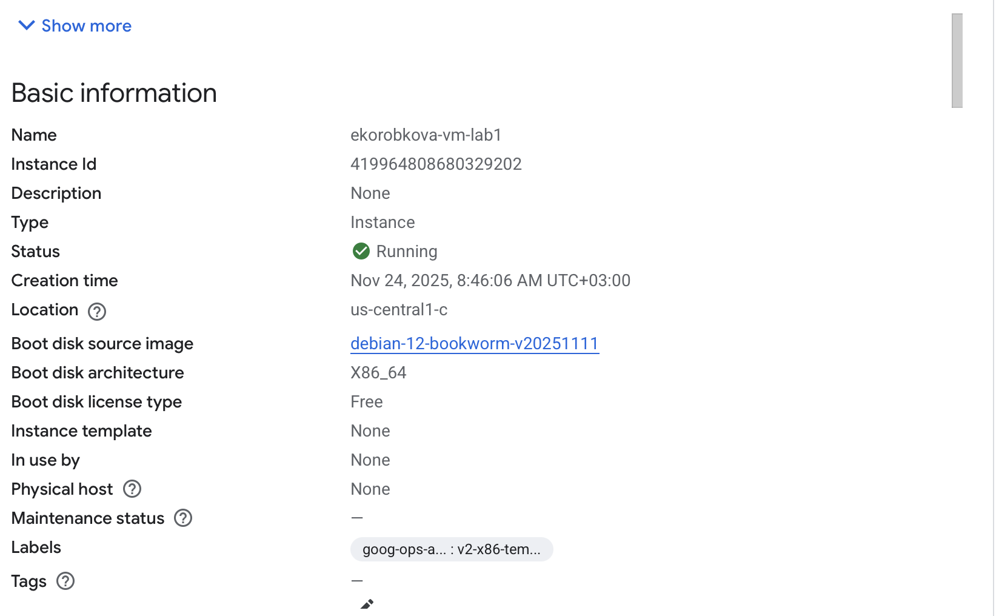
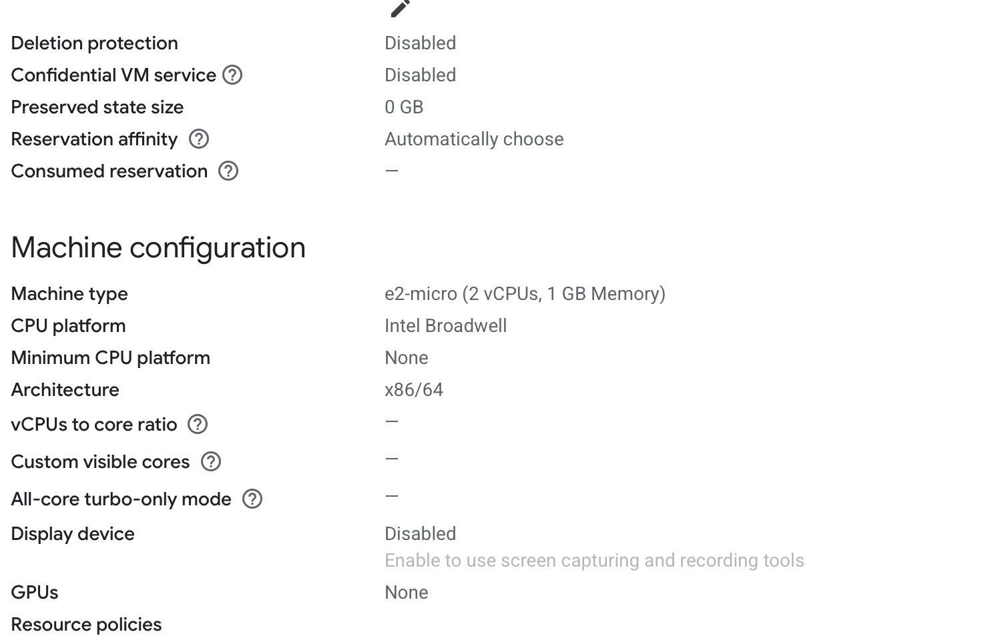
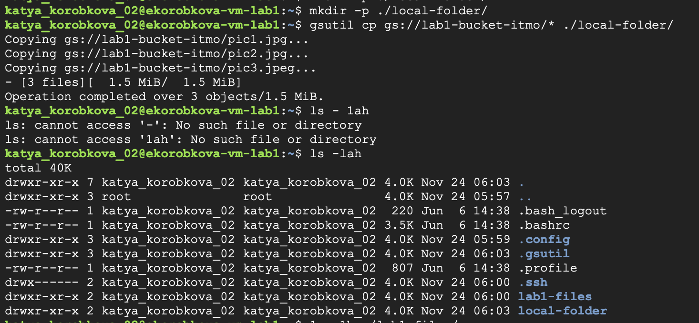
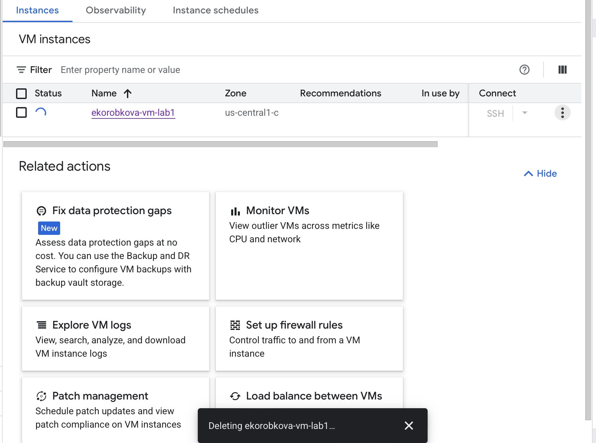
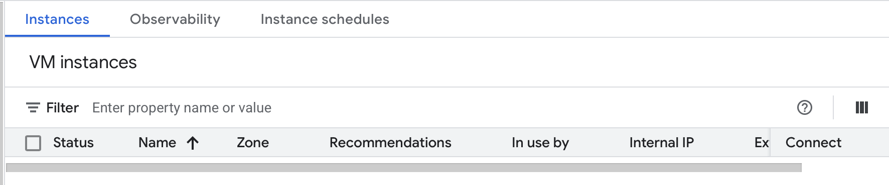

University: ITMO University

Faculty: FICT

Course: Cloud-platforms

Year: 2025/2026

Group: U4225

Author: KOROBKOVA EKATERINA ANDREEVNA

Lab: Lab1

Date of create: 24.11.2025

Date of finished: 24.11.2025

1. Зашла во вкладку IAM, создала service account с ролью Storage Admin.

2. Создала минимальный compute engine (виртуальную машину) с Machine type e2-micro в режиме spot.

3. С помощью утилиты gsutils нашла бакет lab1-bucket-itmo и скопировала 3 файла в локальную папку на VM. Используя команду ls -lah отобразила что эти файлы хранятс на VM.

4. Поменяла права доступа для service account с Storage Admin на Compute Viewer.

5. Повторила пункт с копированием данных, выводы:

Storage Admin позволяет:
Копировать файлы ИЗ Cloud Storage
Загружать файлы В Cloud Storage
Удалять файлы из Cloud Storage
Просматривать Compute Engine ресурсы

Compute Viewer позволяет:
Только просматривать Compute Engine ресурсы (список VM, диски и т.д.)
Не может работать с Cloud Storage

6. Удалите за собой все созданные сервисы.

