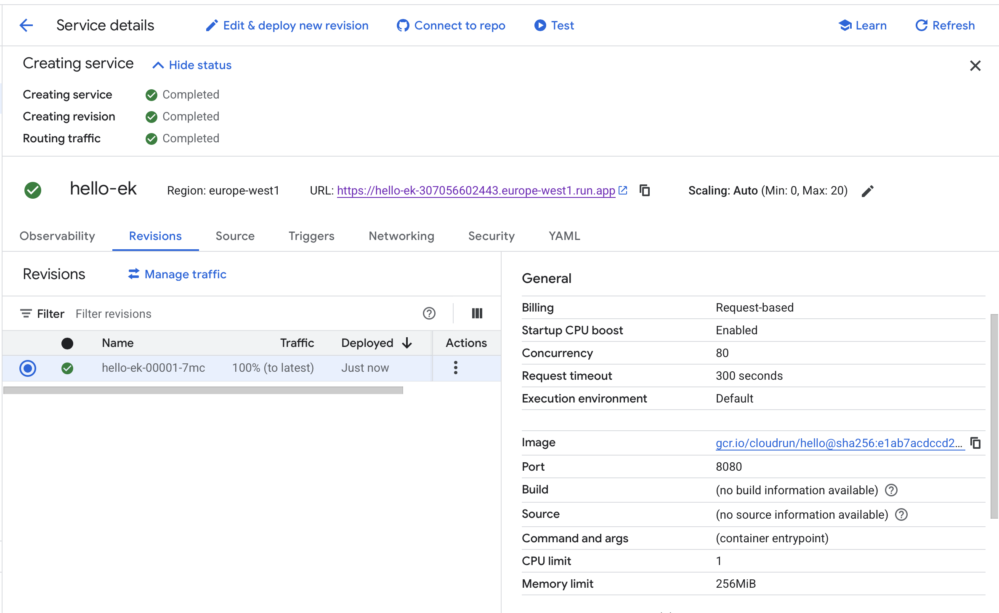
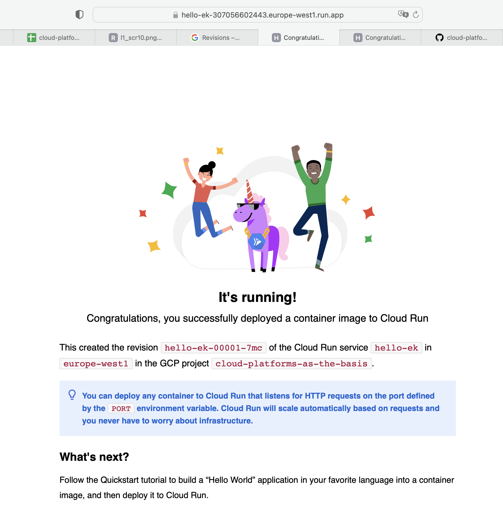
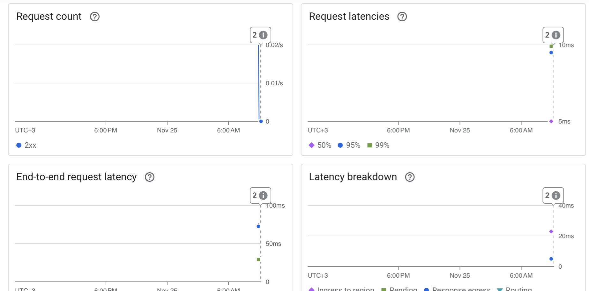
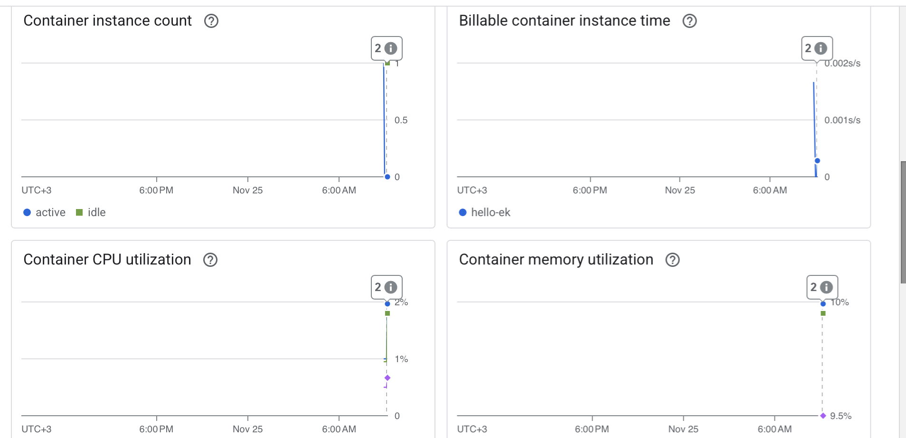
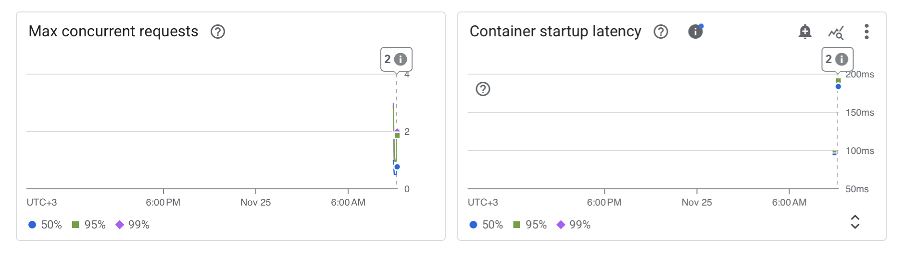
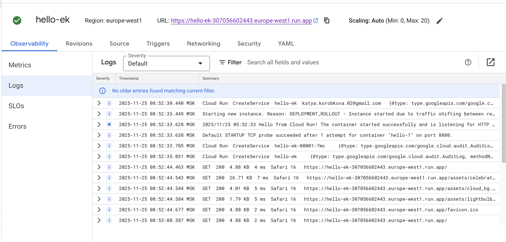
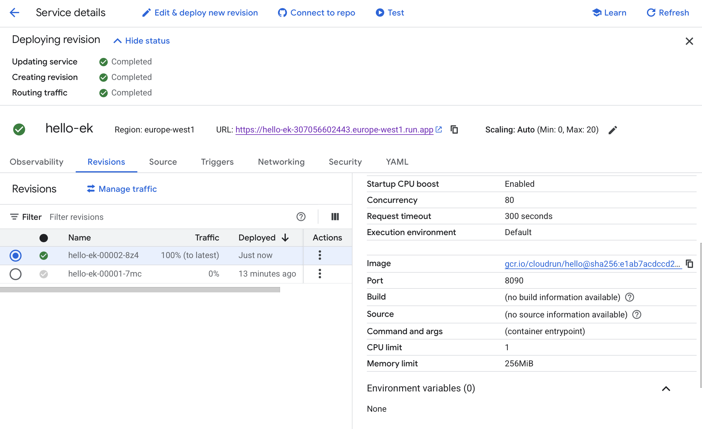
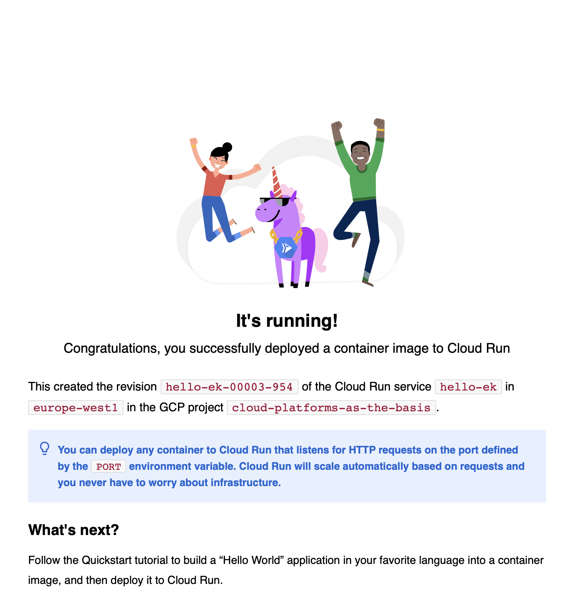
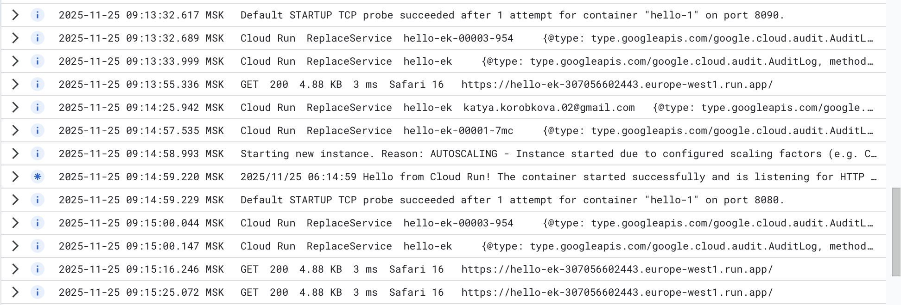
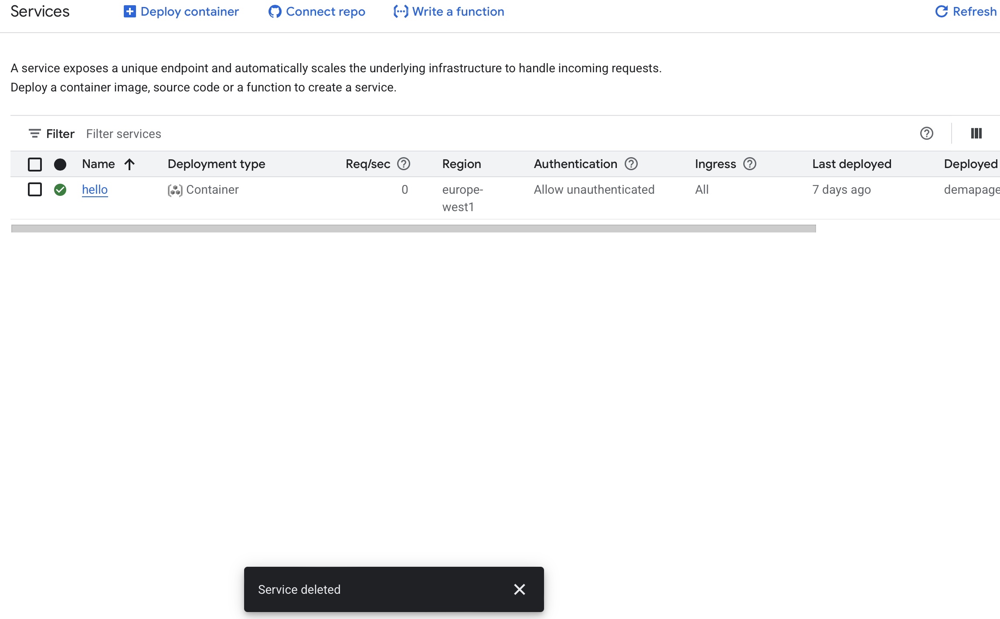

University: ITMO University

Faculty: FICT

Course: Cloud-platforms

Year: 2025/2026

Group: U4225

Author: KOROBKOVA EKATERINA ANDREEVNA

Lab: Lab2

Date of create: 25.11.2025

Date of finished: 25.11.2025

1. Создала Cloud Run из представленного дефолтного сервиса Hello с минимальным количеством ресурсов:
- объем памяти 256 MiB,
- 1 vCPU,
- доступ без аутентификации (Allow unauthenticated).

2. Перешла по ссылке предоставленной Cloud Run, протестировала сервис.

3. Перешла в разделы логи и метрики

**Логи:**

3.1. Инициализация развертывания (08:52:30)

Пользователь: katya.korobkova.02@gmail.com
Действие: Создание сервиса hello-ek через Services.CreateService
Ресурс: namespaces/cloud-platforms-as-the-basis/services/hello-ek

3.2. Запуск инстанса (08:52:33)

Причина: DEPLOYMENT_ROLLOUT - перераспределение трафика между ревизиями
Статус: Успешный запуск контейнера
Порт: 8080 (стандартный для Cloud Run)

3.3. Health Check (08:52:33)

TCP probe на порту 8080 успешно пройден с первой попытки
Контейнер: "hello-1"

3.4. Создание ревизии (08:52:33-08:52:35)

Создана ревизия: hello-ek-00001-7mc
Подтверждено создание сервиса hello-ek

3.5. Обработка HTTP-запросов (08:52:44)

Первоначальный запрос:

GET / - 200 OK, 4.88 KB, 4 ms
User-Agent: Safari 16
URL: https://hello-ek-307056602443.europe-west1.run.app/
Загрузка статических ресурсов:
/assets/celebration.svg (26.71 KB, 7 ms)
/assets/cloud_bg.svg (4.01 KB, 5 ms)
/assets/lightbulb_icon.svg (1.79 KB, 5 ms)
/favicon.ico (4.88 KB, 2 ms)
3.6. Последующий запрос (08:53:08)
Повторный GET / - 200 OK, 4.88 KB, 2 ms
Анализ:
Быстрое развертывание - весь процесс занял ~14 секунд
Успешные health checks - контейнер запустился корректно
Низкая latency - время ответа 2-7 мс
Стабильная работа - все запросы возвращают 200 OK
Сервис был успешно развернут и функционирует нормально, обрабатывая веб-запросы с отличной производительностью.

4. Изменила Cloud Run, поменяв порт на 8090,сервис продолжил работать корректно и не выдал ошибку.

5. Через интерфейс Manage traffic сделала распределения трафика по 50%. Во всех вариантах сервис продолжал корректно отвечать по одному и тому же URL. в логах отображается, какая ревизия обработывает запрос.

6. Удалить за собой все созданные сервисы, написать отчет с использованием скриншотов.

