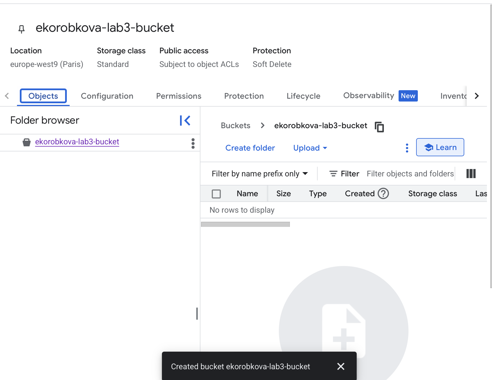
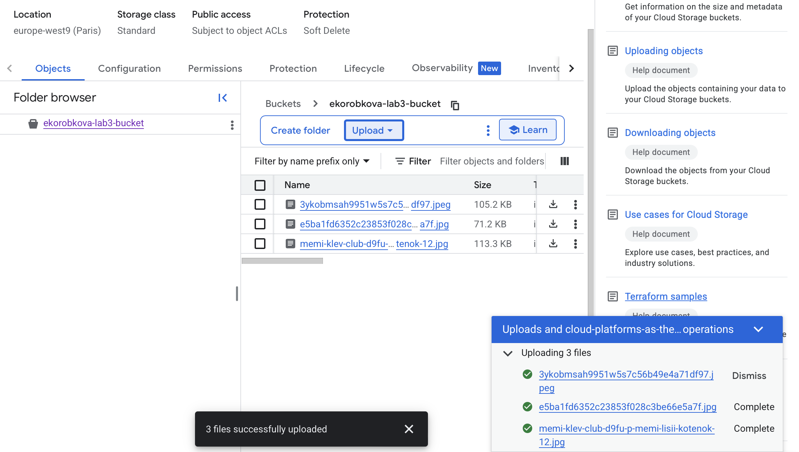
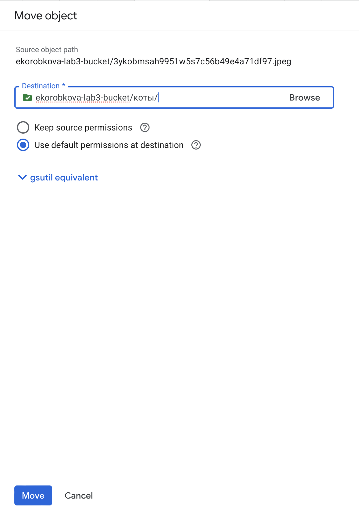
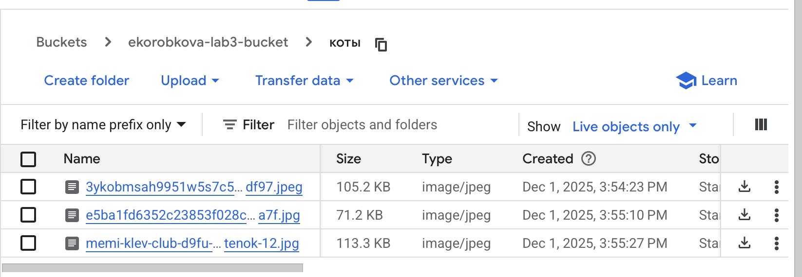
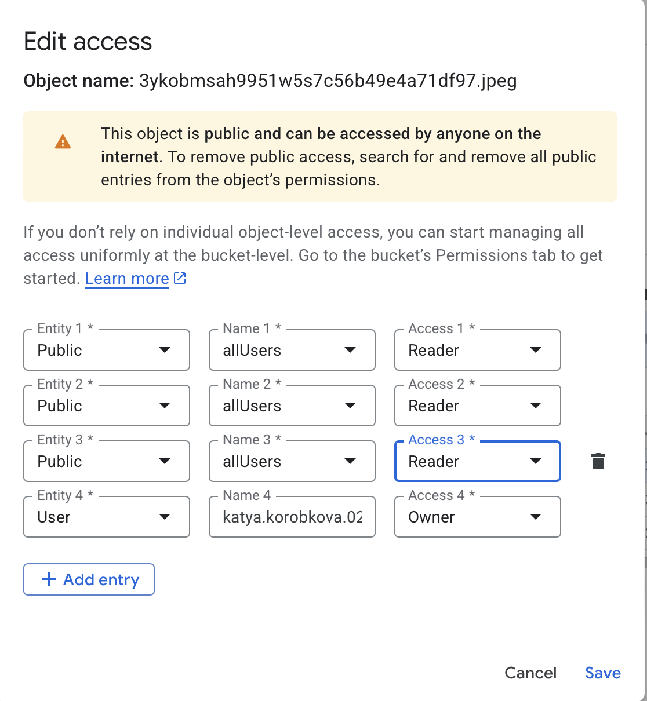
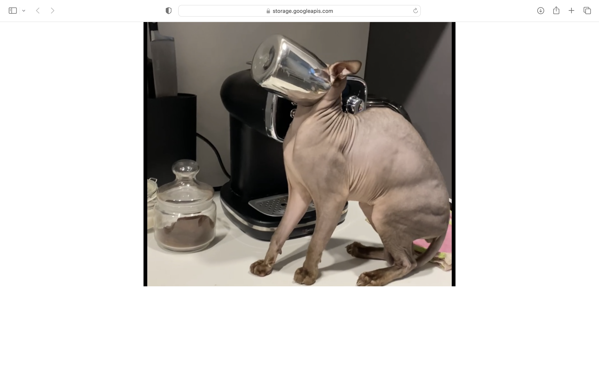

University: ITMO University

Faculty: FICT

Course: Cloud-platforms

Year: 2025/2026

Group: U4225

Author: KOROBKOVA EKATERINA ANDREEVNA

Lab: Lab3

Date of create: 01.12.2025

Date of finished: 01.12.2025

1. Выбрала существующий проект cloud-platforms-as-the-basis, в котором у меня были соответствующие разрешения.

2. Создала Cloud Storage bucket, параметры:

- Регион: europe-west9 (Paris);
- Storage Class: Standard;
- Access control: Fine-grained.

3. Загрузила 3 изображения в Cloud Storage bucket.

4. Создала папку "коты" и переместила файлы туда в пределах бакета через Move.

5. Настроила публичный доступ для файлов в настройках приватности для каждого файла.

6. Создала ссылку на файлы через контекстное меню файла, все ссылки работают

https://storage.googleapis.com/ekorobkova-lab3-bucket/%D0%BA%D0%BE%D1%82%D1%8B/3ykobmsah9951w5s7c56b49e4a71df97.jpeg

https://storage.googleapis.com/ekorobkova-lab3-bucket/%D0%BA%D0%BE%D1%82%D1%8B/memi-klev-club-d9fu-p-memi-lisii-kotenok-12.jpg

https://storage.googleapis.com/ekorobkova-lab3-bucket/%D0%BA%D0%BE%D1%82%D1%8B/e5ba1fd6352c23853f028c3be66e5a7f.jpg
