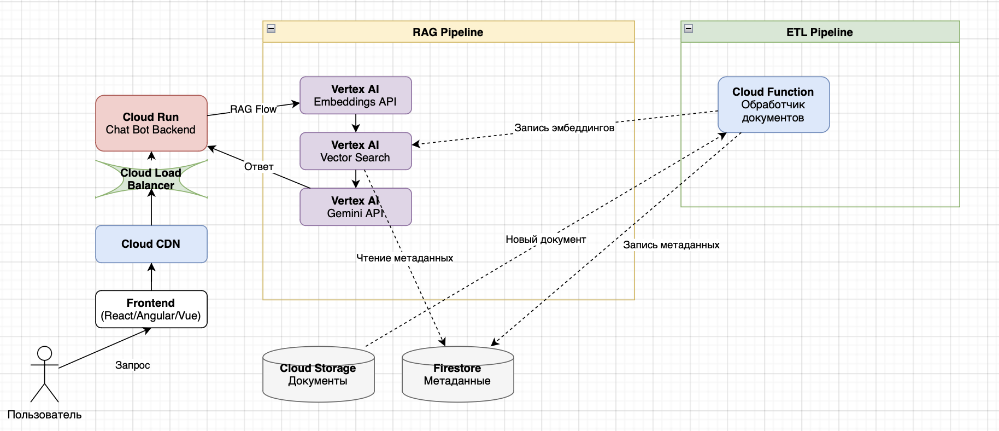
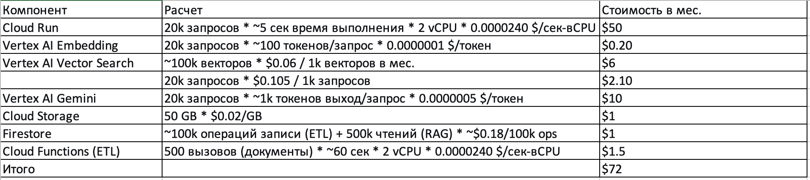
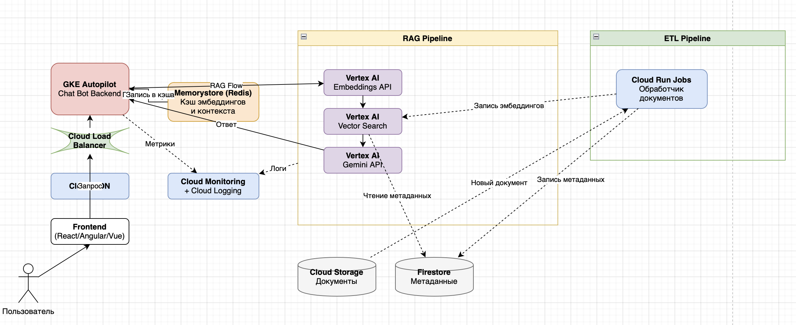
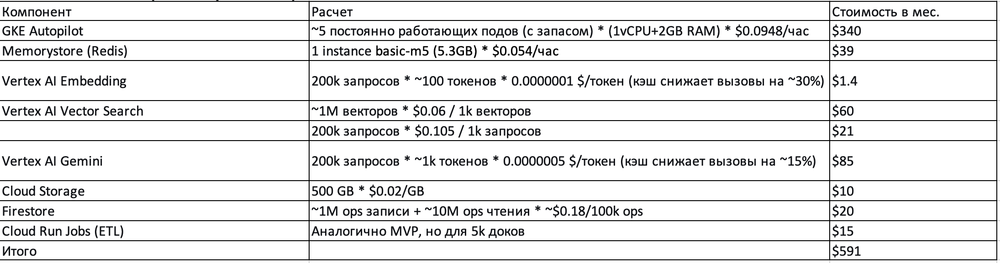
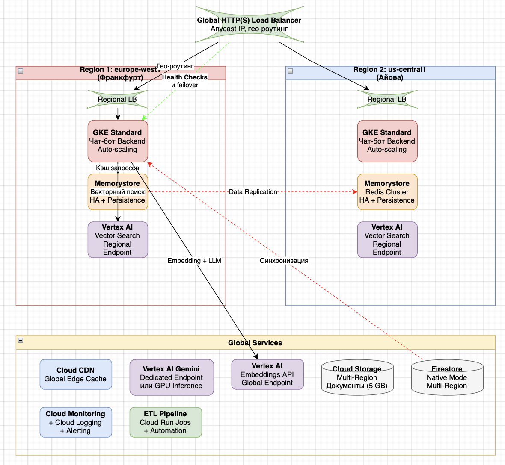
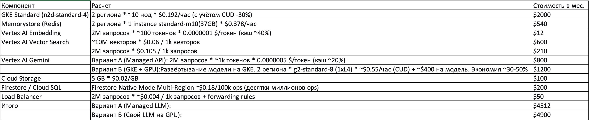

University: ITMO University

Faculty: FICT

Course: Cloud-platforms

Year: 2025/2026

Group: U4225

Author: KOROBKOVA EKATERINA ANDREEVNA

Lab: Lab4

Date of create: 30.11.2025

Date of finished: 01.12.2025

Приложение - чат-бот с RAG (Retrieval-Augmented Generation), отвечающий пользователям на основе базы знаний компании.

**1. Метрики**

Количество запросов:

- MVP: 20 000 / мес
- Pilot: 200 000 / мес
- Prod: 2 000 000 / мес

Объём корпоративных документов:

- MVP: 500 документов (~50 MB)
- Pilot: 5 000 документов (~500 MB)
- Prod: 50 000 документов (~5 GB)
  
Размер векторного индекса:

- MVP: ~100k embeddings
- Pilot: ~1M embeddings
- Prod: ~10M embeddings
  

**2. Модели**

**2.1 Начальная (MVP)**

Логика: Используем полностью serverless-подход от Google Cloud. Это минимизирует затраты на администрирование и позволяет платить только за реальное использование.

**Компоненты:**

- Frontend: Статика загружается в Cloud Storage и раздаётся через Cloud CDN.
- Backend: Контейнер с чат-ботом развернут на Cloud Run. Он бессерверный и автоматически масштабируется до нуля.

**RAG Pipeline (внутри Cloud Run):**

- Embeddings: Вызов textembedding-gecko модели через Vertex AI API.
- Vector Search: Используется Vertex AI Vector Search (ранее Matching Engine) — полностью управляемое решение.
- LLM: Вызов модели Gemini Pro через Vertex AI API.

**Data Layer:**

- Исходные документы: Cloud Storage.
- Метаданные документов: Firestore в бессерверном режиме (проще и дешевле Cloud SQL для NoSQL-данных).

**ETL Pipeline:**

- Триггер: Загрузка файла в Cloud Storage.
- Обработчик: Cloud Function или Cloud Run Job, которая дробит документ, вызывает Embeddings API и обновляет индекс Vector Search.
- Ключевое решение: Отсутствие кэшей и выделенных GPU. Все запросы идут напрямую в managed-сервисы.

**Схема**

**Экономическое обоснование**

**Вывод для MVP:** Serverless-архитектура недорогая для старта. Основные затраты — это исполнение кода на Cloud Run и вызовы LLM.

**2.2 Тестирование партнерами (pilot)**

Логика: Вводим кэширование для снижения затрат и латентности, переносим backend на более производительную и контролируемую платформу.

**Изменения по сравнению с MVP:**

**Backend:** Перенос с Cloud Run на GKE Autopilot. Это даёт больше контроля над контейнерами и их ресурсами, сохраняя "бессерверность" с точки зрения управления нодами.

**Кэширование:** Добавляется Memorystore (Redis) для кэширования двух типов данных:

- Кэш эмбеддингов: Кэшируем эмбеддинги популярных запросов, чтобы не считать их заново.
- Кэш контекста: Кэшируем пары "запрос - найденные чанки", чтобы избежать повторного поиска.
- (Опционально) Кэш ответов LLM: Для идентичных запросов.

**Мониторинг:** Активно используются Cloud Monitoring и Cloud Logging с кастомными дашбордами.
Ключевое решение: GKE Autopilot вместо Cloud Run для лучшего контроля и подготовки к продакшену. Memorystore для экономии денег на API-вызовах.

Цель: стабильность, мониторинг, начать оптимизировать расходы и латентность.

**Схема**

**Экономическое обоснование**

**Вывод:** Затраты растут, но не линейно. Кэш уже начинает экономить деньги на вызовах Embedding и Gemini. Основная статья расходов смещается с pure serverless (Cloud Run) на постоянно работающие сервисы (GKE, Redis).

**2.3 Прод**

**Логика:** Максимальная отказоустойчивость, производительность и оптимизация стоимости. Активное использование резервирования и коммитментов.

**Изменения по сравнению с Pilot:**

**Глобальность:**  Global External HTTP(S) Load Balancer распределяет трафик между несколькими регионами.

**Backend:** GKE Standard (вместо Autopilot) в каждом регионе. Это даёт полный контроль над нодами для тонкой оптимизации и использования preemptible/spot VM. Автоскейлинг кластера и подов.

**Векторный поиск:** Vertex AI Vector Search разворачивается в нескольких региональных эндпоинтах для низкой задержки.

**Базы данных:**

- Firestore переводится в режим Native Mode с мульти-региональной репликацией.
- Cloud SQL (PostgreSQL) может быть рассмотрен как альтернатива, если нужны сложные SQL-запросы к метаданным, также в High-Availability конфигурации.
- Кэширование: Memorystore (Redis) с включённой persistence и репликацией.

**Оптимизация LLM:**

- Рассматривается использование Dedicated Endpoints для Gemini с гарантированным QoS.

**Ключевое решение:** Мульти-региональность, переход на GKE Standard для максимального контроля и оптимизации costs.

**Схема**

**Экономическое обоснование**

**Вывод для Prod:** На первый взгляд, свой LLM на GPU выходит дороже. Однако при стабильной нагрузке можно получить Committed Use Discounts на GPU до 70%, что сделает вариант Б значительно выгоднее (~$3500). Это требует глубокого анализа и является ключевой точкой оптимизации. Основные затраты — инфраструктура (GKE, Redis) и векторная база.

**Обоснование выбора**

Начинаем с Pilot, но разверните сначала в тестовом режиме с ограничением 50k запросов/мес (стоимость ~$300), затем переводим для всех пользователей.

**Обоснование:**

- Подходит RAG (есть кэш, мониторинг)
- Экономически эффективен ($591 vs потенциальные потери из-за плохого MVP)
- Масштабируем без полного переписывания архитектуры
- Риски сведены к минимуму: можно откатиться к Cloud Run если GKE сложно

**Что необходимо для Pilot:**

- Команда с Kubernetes опытом
- Бюджет ~$600/мес
- 2-3 недели на развертывание
- Альтернатива: Если нет Kubernetes экспертизы, но есть бюджет — используйте Cloud Run + Memorystore + расширенный мониторинг. Это будет стоить ~$450/мес и даст 80% преимуществ Pilot.
